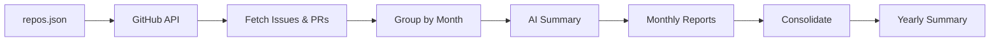

# gh-history

GitHub Year-in-Review CLI — Generate LLM-powered summaries of your GitHub activity across multiple repositories.

## Features

- Fetch issues and pull requests from multiple GitHub repositories
- Filter by year and month(s)
- Generate AI-powered summaries using OpenAI or Anthropic
- Output reports in Markdown and JSON formats
- File-based caching to avoid re-fetching data
- Dry-run mode to preview without LLM calls
- Consolidate all reports into a single yearly summary

## How It Works



1. **Fetch** — Pull issues and PRs from GitHub API for each repo
2. **Group** — Organize activity by month
3. **Summarize** — Send to LLM (OpenAI/Anthropic) for AI-generated summary
4. **Report** — Output Markdown + JSON files per repo/month
5. **Consolidate** — Merge all monthly reports into a single yearly overview

## Installation

```bash
pnpm install
```

## Configuration

Create a `.env` file based on `env.example`:

```bash
# Required: GitHub Personal Access Token
GITHUB_TOKEN=ghp_xxxx

# Required: At least one of these based on --provider flag (default: openai)
OPENAI_API_KEY=sk-xxxx
ANTHROPIC_API_KEY=sk-ant-xxxx

# Optional: Override default provider and model
# LLM_PROVIDER=openai
# LLM_MODEL=gpt-4o-mini
```

### Getting API Keys

1. **GitHub Token**: Go to [GitHub Settings > Developer settings > Personal access tokens](https://github.com/settings/tokens) and create a token with `repo` scope for private repos or `public_repo` for public only.

2. **OpenAI API Key**: Get from [platform.openai.com](https://platform.openai.com/api-keys)

3. **Anthropic API Key**: Get from [console.anthropic.com](https://console.anthropic.com/)

## Usage

### Basic Usage

```bash
# Process all repos in repos.json for 2025
pnpm report

# Specific months
pnpm report --months 1,2,3

# Specific month range
pnpm report --months 1-6

# Specific repos (override repos.json)
pnpm report --repos scaffold-eth/scaffold-eth-2,BuidlGuidl/abi.ninja

# Different year
pnpm report --year 2024

# Different LLM provider
pnpm report --provider anthropic

# Specific model
pnpm report --provider openai --model gpt-4o

# Skip cache (re-fetch all data)
pnpm report --no-cache

# Dry run (fetch data but skip LLM calls)
pnpm report --dry-run
```

### Consolidate Reports

After generating monthly reports, consolidate them into a single yearly summary:

```bash
# Consolidate all 2025 reports
pnpm consolidate

# Different year
pnpm consolidate -- --year 2024

# Custom output file
pnpm consolidate -- --output my-summary.json

# Dry run (aggregate without LLM calls)
pnpm consolidate -- --dry-run
```

### CLI Options

| Option                      | Description                                       |
| --------------------------- | ------------------------------------------------- |
| `-r, --repos <repos>`       | Comma-separated list of repos (owner/repo format) |
| `-m, --months <months>`     | Months to process (e.g., '1,2,3' or '1-6')        |
| `-y, --year <year>`         | Year to process (default: 2025)                   |
| `-p, --provider <provider>` | LLM provider: openai or anthropic                 |
| `--model <model>`           | LLM model to use                                  |
| `--no-cache`                | Disable caching                                   |
| `--dry-run`                 | Fetch data but skip LLM calls                     |
| `-o, --output <dir>`        | Output directory                                  |

## Output

Reports are generated in the `output/` directory:

- `output/2025-01-scaffold-eth-2.md` - Human-readable Markdown summary
- `output/2025-01-scaffold-eth-2.json` - Structured JSON data

### Sample Output

```markdown
# scaffold-eth/scaffold-eth-2 - January 2025

> Generated on January 8, 2025 at 10:30 AM

## Activity Overview

- **Issues Created:** 12
- **Pull Requests Created:** 8

## Summary

- **New Features**: Added support for multiple chain deployments and improved the contract deployment workflow
- **Bug Fixes**: Fixed wallet connection issues on mobile browsers
- **Documentation**: Updated README with clearer setup instructions
- **Refactoring**: Migrated from wagmi v1 to v2

## Notable Issues

- ✅ [#123: Add multi-chain support](https://github.com/scaffold-eth/scaffold-eth-2/issues/123)
- 🔴 [#124: Mobile wallet connection bug](https://github.com/scaffold-eth/scaffold-eth-2/issues/124)

## Notable Pull Requests

- 🟣 [#125: feat: multi-chain deployment](https://github.com/scaffold-eth/scaffold-eth-2/pull/125) (merged)
- 🟢 [#126: fix: mobile wallet connection](https://github.com/scaffold-eth/scaffold-eth-2/pull/126) (open)
```

## Repository List

The default repository list is stored in `repos.json`. Edit this file to customize which repos to analyze:

```json
{
  "repos": [
    "BuidlGuidl/SpeedRunEthereum-v2",
    "scaffold-eth/scaffold-eth-2",
    "scaffold-eth/create-eth"
  ]
}
```

## Architecture

```
src/
├── cli.ts              # Entry point, Commander setup
├── config.ts           # Env loading + Zod validation
├── types.ts            # Shared TypeScript types
├── grouping.ts         # Group items by month, prepare LLM payload
├── github/
│   ├── client.ts       # Octokit wrapper
│   ├── fetch.ts        # Paginated issue/PR fetcher
│   └── parse-url.ts    # Normalize repo URLs
├── summarize/
│   ├── provider.ts     # Vercel AI SDK setup
│   ├── prompt.ts       # Prompt templates
│   └── summarize.ts    # Core summarization logic
├── consolidate/
│   ├── reader.ts       # Read JSON reports from output/
│   ├── prompt.ts       # Meta-summary prompt templates
│   └── consolidate.ts  # Yearly consolidation logic
├── report/
│   ├── markdown.ts     # Markdown report generator
│   └── json.ts         # JSON output
└── utils/
    ├── cache.ts        # File-based cache
    └── progress.ts     # Spinner/progress helpers
```

## License

ISC
